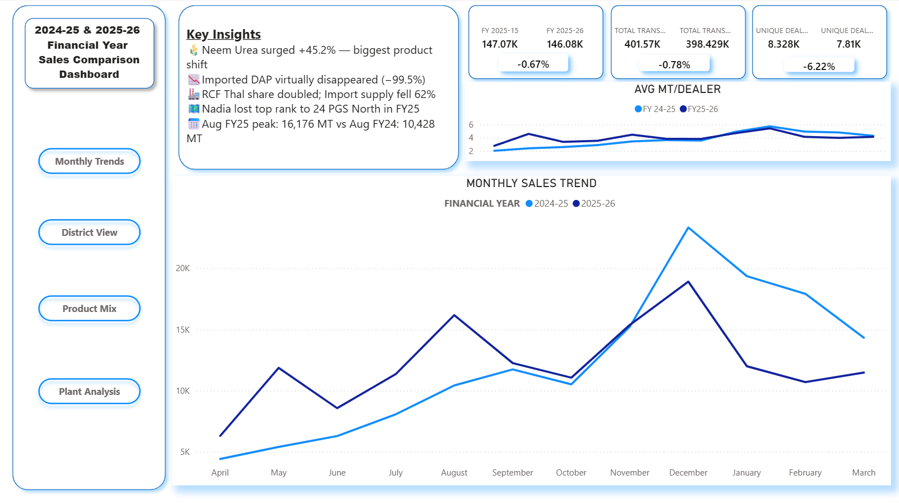

# FY 2024-25 vs FY 2025-26 Sales Analysis Dashboard

## Project Overview

This Power BI project provides a comparative analysis of sales performance between FY 2024-25 and FY 2025-26 using Excel as the primary data source. The dashboard helps identify growth trends, district-wise performance, product contribution, and plant-level sales insights.

## Tools Used

* Power BI
* Microsoft Excel

## Dashboard Pages

### 1. Overview

* Key Performance Indicators (KPIs)
* Navigation Panel
* Business Insights
* FY Sales Comparison Trend
* Monthly Average Sales Analysis

 

### 2. Monthly Trend

* Month-wise FY Comparison
* Combined Column & Line Charts
* Monthly Sales Table
* Percentage Change Analysis

### 3. District View

* District-wise Sales Comparison
* Interactive District Cards
* FY-wise Sales Performance
* Growth/Decline Percentage by District

### 4. Product Mix

* Product-wise Sales Analysis
* FY Comparison Charts
* Product Performance Cards
* Percentage Change Tracking

### 5. Plant Analysis

* Plant-wise Sales Performance
* Total Sales Contribution by Plant
* Comparative FY Analysis
* Key Plant-Level KPIs

## Key Objectives

* Compare sales performance across two financial years.
* Identify high-performing and underperforming districts, products, and plants.
* Support data-driven business decisions through interactive visualizations.

## Data Source

Sales data sourced from Microsoft Excel and transformed into interactive Power BI dashboards for analysis and reporting.

## Download as PDF

- <a href="https://github.com/Dairanji/2024-25-vs-2025-26-Financial-Year-Sales-Analysis/blob/main/RCF_SALES_COMPARISON_FY_2024-25_VS_2025-26.pdf">Download</a>

